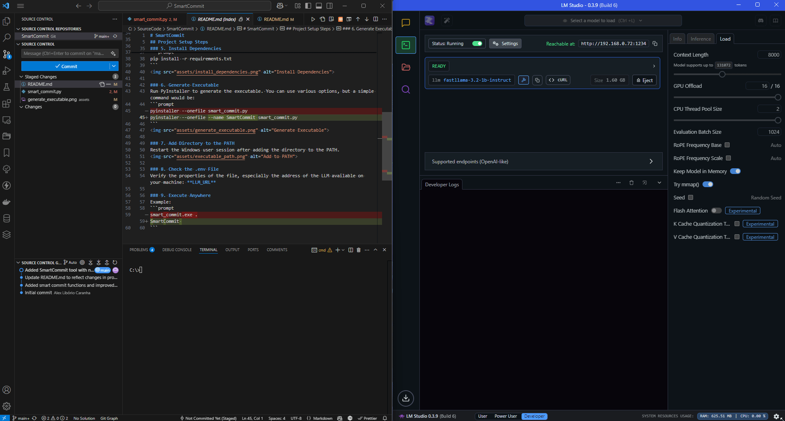

# SmartCommit

SmartCommit is an intelligent tool that analyzes code changes and suggests clear and concise commit messages. Its goal is to automate the writing of informative commits, helping developers maintain an organized project history.

## 📌 Features

✔️ Automatic commit message generation;  
✔️ Integration with language models (LLM);  
✔️ Easy and quick setup.  

## 🛠️ Installation & Usage

### 1️⃣ Clone the repository
```bash
git clone https://github.com/AlexCaranha/SmartCommit.git
cd SmartCommit
```

### 2️⃣ Verify Python installation
```bash
python --version
```

> **Requirement:** Python 3.11  

### 3️⃣ Set up a virtual environment
```bash
python -m venv venv
source venv/bin/activate  # Linux/macOS
venv\Scripts\activate      # Windows
```


### 4️⃣ Install dependencies
```bash
pip install -r requirements.txt
```


### 5️⃣ Generate the executable
```bash
pyinstaller --onefile --name SmartCommit smart_commit.py
```
> O executável será gerado na pasta `dist/`.  


### 6️⃣ Configure the PATH (Windows)
Add the dist/ directory to the system PATH to run SmartCommit from anywhere.  


### 7️⃣ Configure the properties
Verify or update the parameters at the beginning of the smart_commit.py:  

```bash
TEMPERATURE=0.7
MAX_TOKENS=-1
LLM_URL="http://localhost:1234/v1/chat/completions"
PROMPT_LLM="As a commit message expert, analyze the changes in the source code and suggest a commit message that is clear, direct, concise, and in English. Highlight instances of new or deleted files. Provide only the commit message without additional explanations or information. Keep the message brief."
```

### 8️⃣ Run SmartCommit from the command prompt

#### Inside the repository:  
```bash
cd c:\MyLocalRepository
SmartCommit .
```
#### Specifying the repository path:  
```bash
SmartCommit c:\MyLocalRepository
```

#### Demo:  


---

## ❓ FAQ

**Does SmartCommit work on Linux/macOS?**  
The script has been tested on Windows, but it should work on UNIX systems with minor adjustments.

**Can I customize the generated messages?**  
Yes! You can modify its behavior by adjusting the prompts sent to the language model.

**What if the SmartCommit command is not recognized?**  
Ensure that the directory containing the executable is added to the system PATH.

---

## 📜 License

This project is licensed under the GNU GENERAL PUBLIC LICENSE. See the `LICENSE` file for more details.

