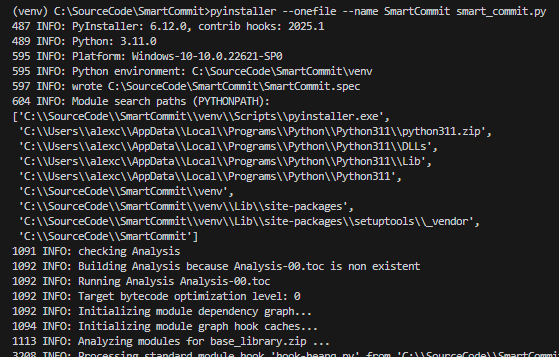

# SmartCommit

SmartCommit is an intelligent tool designed to analyze code changes and provide clear, concise commit message suggestions. It streamlines the process of writing commit messages, ensuring that they accurately reflect the changes made in the codebase. With SmartCommit, developers can maintain a well-documented and organized project history effortlessly.

## Project Setup Steps

### 1. Clone the Repository
To clone the repository, run the following command:
```prompt
git clone https://github.com/AlexCaranha/SmartCommit.git
```


### 2. Verify Python Installation
Ensure that Python version 3.11 is installed by running:
```prompt
python --version
```


### 3. Create a Virtual Environment
Create a virtual environment using the following command:
```prompt
python -m virtualenv venv
```


### 4. Activate the Virtual Environment
Activate the virtual environment with:
```prompt
venv\Scripts\activate
```


### 5. Install Dependencies
Install the required dependencies by running:
```prompt
pip install -r requirements.txt
```


### 6. Generate Executable
Run PyInstaller to generate the executable. You can use various options, but a simple command would be:
```prompt
pyinstaller --onefile --name SmartCommit smart_commit.py
```


### 7. Add Directory to the PATH
Restart the Windows user session after adding the directory to the PATH.


### 8. Check the .env File
Verify the properties of the file, especially the address of the LLM available on your machine: **LLM_URL**

### 9. Execute Anywhere
Example:
```prompt
SmartCommit 
```