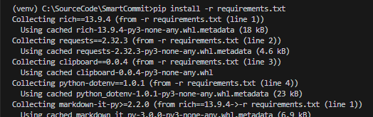

# SmartCommit

## Project Setup Steps

### 1. Clone the Repository
To clone the repository, run the following command:
```prompt
git clone https://github.com/AlexCaranha/SmartCommit.git
```


### 2. Verify Python Installation
Ensure that Python version 3.11 is installed by running:
```prompt
python --version
```


### 3. Create a Virtual Environment
Create a virtual environment using the following command:
```prompt
python -m virtualenv venv
```


### 4. Activate the Virtual Environment
Activate the virtual environment with:
```prompt
venv\Scripts\activate
```


### 5. Install Dependencies
Install the required dependencies by running:
```prompt
pip install -r requirements.txt
```

