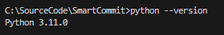
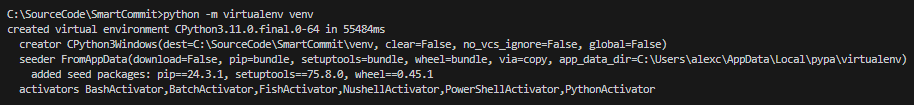
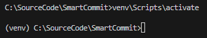
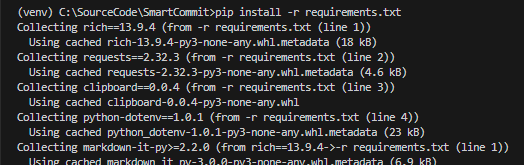
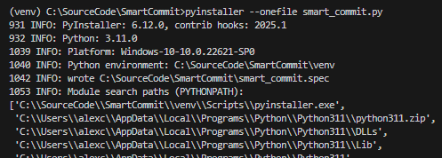
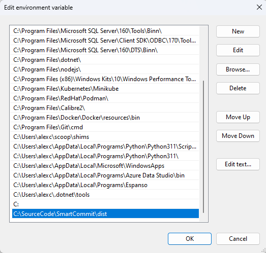

# SmartCommit 🚀

SmartCommit é uma ferramenta inteligente que analisa mudanças no código e sugere mensagens de commit claras e concisas. Seu objetivo é automatizar a escrita de commits informativos, ajudando desenvolvedores a manter um histórico organizado do projeto.

## 📌 Recursos

✔️ Geração automática de mensagens de commit;  
✔️ Suporte para múltiplos repositórios locais;  
✔️ Integração com modelos de linguagem (LLM);  
✔️ Configuração fácil e rápida.  

## 🛠️ Instalação e Uso

### 1️⃣ Clone o repositório
```bash
git clone https://github.com/AlexCaranha/SmartCommit.git
cd SmartCommit
```

### 2️⃣ Verifique a instalação do Python
```bash
python --version
```

> **Requisito:** Python 3.11  

### 3️⃣ Configure o ambiente virtual
```bash
python -m venv venv
source venv/bin/activate  # Linux/macOS
venv\Scripts\activate      # Windows
```



### 4️⃣ Instale as dependências
```bash
pip install -r requirements.txt
```


### 5️⃣ Gere o executável
```bash
pyinstaller --onefile --name SmartCommit smart_commit.py
```
> O executável será gerado na pasta `dist/`.  



### 6️⃣ Configure o PATH (Windows)
Adicione o diretório `dist/` ao PATH para executar `SmartCommit` de qualquer lugar.  



### 7️⃣ Configure o arquivo `.env`
Crie um arquivo `.env` na raiz do projeto e adicione a URL do modelo de linguagem, o prompt e os demais parâmetros:  

```env
TEMPERATURE=0.7
MAX_TOKENS=-1
LLM_URL="http://localhost:1234/v1/chat/completions"
PROMPT_LLM="As a commit message expert, analyze the changes in the source code and suggest a commit message that is clear, direct, concise, and in English. Highlight instances of new or deleted files. Provide only the commit message without additional explanations or information. Keep the message brief."
```

### 8️⃣ Execute o SmartCommit via prompt de comando

#### Dentro do repositório:  
```bash
cd c:\MyLocalRepository
SmartCommit .
```
#### Especificando o caminho do repositório:  
```bash
SmartCommit c:\MyLocalRepository
```

---

## ❓ FAQ

**O SmartCommit funciona no Linux/macOS?**  
Atualmente, o script foi testado no Windows, mas deve funcionar em sistemas UNIX com pequenos ajustes.  

**Posso personalizar as mensagens geradas?**  
Sim! Você pode modificar o comportamento ajustando os prompts enviados ao modelo de linguagem.  

**O que fazer se o comando `SmartCommit` não for reconhecido?**  
Certifique-se de que o diretório contendo o executável está no PATH do sistema.  

---

## 📜 Licença

Este projeto está licenciado sob a licença GNU GENERAL PUBLIC LICENSE. Consulte o arquivo `LICENSE` para mais detalhes.

